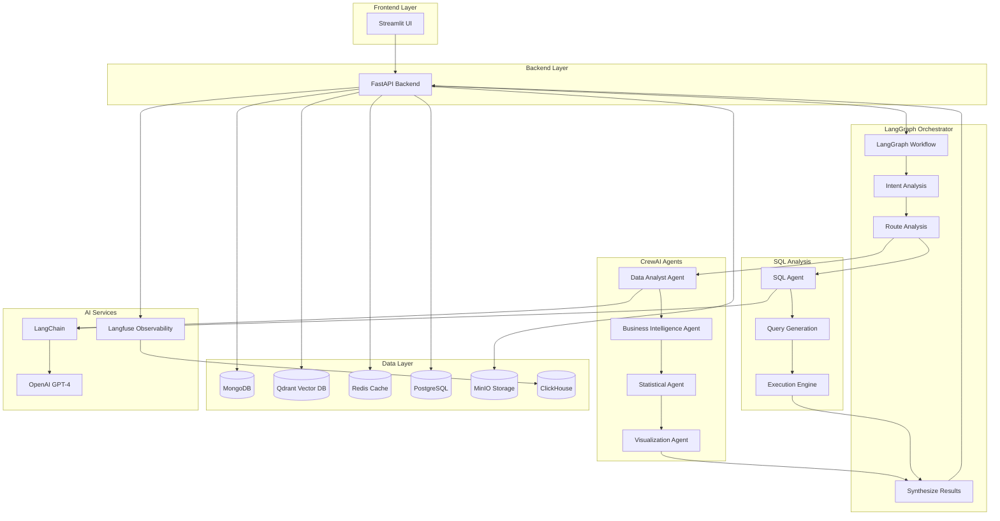

# 🤖 Chat with Data

> **Intelligent Data Analysis Platform** - Transform your data into insights through natural language conversations powered by CrewAI and LangGraph

[](https://www.python.org/downloads/)
[](https://github.com/joaomdmoura/crewAI)
[](https://github.com/langchain-ai/langgraph)
[](https://fastapi.tiangolo.com/)
[](https://www.docker.com/)
[](https://github.com/astral-sh/uv)

## 🌟 Overview

**Chat with Data** is a next-generation platform that revolutionizes data analysis through intelligent multi-agent conversations. Upload CSV, Excel, or JSON files and engage with your data using natural language, powered by CrewAI's collaborative agents and LangGraph's sophisticated workflow orchestration.

### ✨ Key Features

- 🗣️ **Natural Language Queries** - Ask complex questions about your data in plain English
- 🤖 **Multi-Agent Intelligence** - CrewAI agents collaborate for comprehensive analysis
- 🔄 **Workflow Orchestration** - LangGraph manages complex analysis workflows
- 💬 **Conversational Memory** - Maintains context across analysis sessions
- 🎯 **Intent Recognition** - Intelligent routing to appropriate analysis methods
- 🚀 **Python 3.12 Performance** - Latest Python with enhanced speed and features
- 🐳 **Production Ready** - Complete Docker orchestration with microservices
- 🔐 **Enterprise Security** - Authentication, rate limiting, and data privacy

## 🏗️ Architecture



## 🛠️ Technology Stack

### **Core Technologies**
- **Python 3.12** - Latest version with enhanced performance and new features
- **FastAPI** - Modern, fast web framework for building APIs
- **Streamlit** - Interactive web app framework for data science
- **UV Package Manager** - 10-100x faster than pip for dependency management

### **AI & Multi-Agent Framework**
- **CrewAI 0.134.0+** - Advanced multi-agent collaboration framework
- **LangGraph 0.5.0** - Workflow orchestration for complex AI tasks
- **LangChain 0.3.26** - Framework for developing LLM applications
- **OpenAI GPT-4** - Advanced language model for intelligent analysis
- **Langfuse 3.0.8** - LLM observability, analytics, and evaluation platform

#### 🚀 CrewAI Multi-Agent Capabilities
- **Specialized Agents**: Data Analyst, Business Intelligence, Statistical, Visualization experts
- **Collaborative Analysis**: Agents work together for comprehensive insights
- **Role-Based Processing**: Each agent contributes unique expertise
- **Sequential Workflows**: Coordinated task execution for complex analysis
- **Delegation & Cooperation**: Agents can delegate tasks and share knowledge

#### 🔗 LangGraph Orchestration
- **Workflow Management**: Sophisticated state-based analysis flows
- **Intent Recognition**: Intelligent routing based on query analysis
- **Result Synthesis**: Combines insights from multiple analysis methods
- **Memory Management**: Maintains context across analysis sessions
- **Error Handling**: Robust fallback mechanisms for reliable operation

### **Data & Storage**
- **MongoDB** - Document database for chat history and metadata
- **Qdrant** - Vector database for semantic search
- **PostgreSQL** - Relational database for structured data
- **Redis** - In-memory cache for session management
- **MinIO** - S3-compatible object storage for files

### **Infrastructure**
- **Docker & Docker Compose** - Containerization and orchestration
- **ClickHouse** - Analytics database for Langfuse observability
- **Langfuse** - LLM and AI agent observability and analytics

## 🚀 Quick Start

### Prerequisites

- **Python 3.12** - [Download Python](https://www.python.org/downloads/) or use pyenv
- **Git** - Version control system
- **OpenAI API Key** - For AI-powered analysis

### Development Setup (Recommended)

For development and local testing:

```bash
# 1. Clone the repository
git clone https://github.com/yourusername/chat-with-data.git
cd chat-with-data

# 2. Run the automated setup script
chmod +x setup-dev.sh
./setup-dev.sh

# 3. Configure environment
cp .env.example .env
# Edit .env with your OpenAI API key

# 4. Start the application
# Terminal 1 - Backend
cd backend
uv run uvicorn main:app --reload --host 0.0.0.0 --port 8000

# Terminal 2 - Frontend  
cd frontend
uv run streamlit run streamlit_app.py --server.port 3000
```

**Access the application:**
- Frontend: http://localhost:3000
- Backend API: http://localhost:8000
- API Docs: http://localhost:8000/docs

### Production Setup (Docker)

For production deployment with Docker:

### 1. Clone the Repository

```bash
git clone https://github.com/yourusername/chat-with-data.git
cd chat-with-data
```

### 2. Environment Setup

```bash
# Copy environment template
cp .env.example .env

# Edit .env file with your API keys (this file is git-ignored for security)
nano .env
```

**Required Environment Variables:**
```bash
# OpenAI API Key (Required)
OPENAI_API_KEY=sk-your-openai-api-key-here

# Optional: Additional AI providers
ANTHROPIC_API_KEY=your-anthropic-key
GOOGLE_API_KEY=your-google-key

# Langfuse Self-Hosted for LLM Observability (automatically configured)
LANGFUSE_ENABLED=true
LANGFUSE_HOST=http://localhost:3001

# Database passwords (change in production)
MONGODB_ROOT_PASSWORD=your-secure-password
POSTGRES_PASSWORD=your-secure-password
```

> **🔒 Security Note**: The `.env` file containing your API keys is automatically excluded from Git via `.gitignore` to protect your credentials.

### 3. Launch the Platform

```bash
# Option 1: Start all services at once
docker-compose up -d

# Option 2: Start services by category using profiles
# Start databases only (MongoDB, PostgreSQL, Redis, Qdrant, ClickHouse)
COMPOSE_PROFILES=db docker-compose up -d

# Start supporting services (MinIO, Langfuse)
COMPOSE_PROFILES=service docker-compose up -d

# Start application services
COMPOSE_PROFILES=backend docker-compose up -d    # FastAPI backend
COMPOSE_PROFILES=frontend docker-compose up -d   # Streamlit frontend

# Start databases + services together
COMPOSE_PROFILES=db,service docker-compose up -d

# Start full stack (all profiles)
COMPOSE_PROFILES=db,service,backend,frontend docker-compose up -d

# View logs
docker-compose logs -f
```

### 4. Access the Application

- **Web Interface**: http://localhost:8501
- **API Documentation**: http://localhost:8000/docs
- **Langfuse Dashboard**: http://localhost:3001 (LLM Observability & Analytics)

## 📋 Usage Examples

### Multi-Agent Data Analysis

1. **Upload a Dataset**
   - Supported formats: CSV, Excel (.xlsx/.xls), JSON, Parquet
   - Maximum file size: 100MB

2. **Natural Language Queries**
   ```
   "What are the key patterns in our sales data?"
   "Compare performance across different regions"
   "Identify trends and anomalies in customer behavior"
   "Generate insights and recommendations for business strategy"
   ```

3. **Multi-Agent Collaboration**
   - **Data Analyst Agent**: Performs initial data exploration and statistical analysis
   - **Business Intelligence Agent**: Translates findings into business recommendations
   - **Statistical Agent**: Validates findings with rigorous statistical methods
   - **Visualization Agent**: Creates compelling charts and graphs

### Advanced Workflow Examples

#### Comprehensive Business Analysis
```
"Analyze our quarterly sales data and provide strategic recommendations"
```
**LangGraph Workflow:**
1. Intent Analysis → Identifies need for comprehensive business analysis
2. Route to CrewAI → Engages multiple specialized agents
3. Data Analyst → Explores data patterns and trends
4. Statistical Agent → Validates statistical significance
5. Business Intelligence → Generates strategic recommendations
6. Visualization Agent → Creates executive dashboard
7. Synthesis → Combines all insights into coherent response

#### Database + File Analysis
```
"Compare our database customer data with the uploaded survey results"
```
**LangGraph Workflow:**
1. Intent Analysis → Identifies need for multi-source analysis
2. Route to Both → SQL Agent + CrewAI collaboration
3. SQL Agent → Queries customer database
4. CrewAI Agents → Analyze survey file data
5. Synthesis → Combines insights from both sources

## 🔧 Development Setup

### Prerequisites for Development

- **Conda** - Python environment management ([Install Miniconda](https://docs.conda.io/en/latest/miniconda.html))
- **UV Package Manager** - Ultra-fast Python package installer ([Auto-installed in setup](https://github.com/astral-sh/uv))

### Local Development with Conda + UV (Python 3.12)

```bash
# 1. Create conda environments for Python 3.12
conda create -n chat-backend python=3.12 -y
conda create -n chat-frontend python=3.12 -y

# 2. Install UV in both environments
conda activate chat-backend
pip install uv
conda deactivate

conda activate chat-frontend  
pip install uv
conda deactivate

# 3. Setup backend development
conda activate chat-backend
cd backend
uv pip install -e ".[dev]"  # Install packages via pyproject.toml

# 4. Setup frontend development  
conda activate chat-frontend
cd frontend
uv pip install -e ".[dev]"  # Install packages via pyproject.toml
```

### Running Development Servers

```bash
# Terminal 1: Backend API Server
conda activate chat-backend
cd backend
uv run uvicorn main:app --reload --host 0.0.0.0 --port 8000

# Terminal 2: Frontend Streamlit App
conda activate chat-frontend  
cd frontend
uv run streamlit run streamlit_app.py --server.port 8501
```

### Why Python 3.12? 🐍

**Performance Improvements:**
- **15% faster** function calls and attribute access
- **Improved error messages** with better debugging
- **Enhanced type hints** for better code quality
- **New syntax features** for cleaner code

**CrewAI & LangGraph Benefits:**
- Full compatibility with latest AI frameworks
- Enhanced async performance for multi-agent workflows
- Better memory management for large-scale analysis
- Improved debugging for complex agent interactions

### Development Commands

```bash
# Package Management
uv add crewai langgraph pandas         # Add new dependencies
uv add --dev pytest black mypy        # Add development dependencies  
uv pip install --upgrade-package crewai  # Upgrade specific package
uv lock                               # Update dependency lock file

# Code Quality
uv run black .                        # Format code
uv run isort .                        # Sort imports
uv run mypy .                         # Type checking
uv run flake8 .                       # Linting

# Testing
uv run pytest                         # Run all tests
uv run pytest --cov=.                 # Run tests with coverage
uv run pytest tests/agents/           # Run agent tests

# Development Utilities
uv run uvicorn main:app --reload      # Start backend with hot reload
uv run streamlit run app.py           # Start frontend with hot reload
```

## 🤖 AI Agents & Capabilities

### CrewAI Multi-Agent System

#### **Data Analyst Agent**
- **Role**: Senior Data Analyst
- **Capabilities**: Statistical analysis, pattern recognition, data mining
- **Specialization**: Identifies trends, anomalies, and data insights

#### **Business Intelligence Agent**
- **Role**: Business Intelligence Specialist  
- **Capabilities**: Strategic analysis, business recommendations
- **Specialization**: Translates data insights into actionable business strategy

#### **Statistical Agent**
- **Role**: Statistical Analyst
- **Capabilities**: Advanced statistical modeling, hypothesis testing
- **Specialization**: Validates findings with rigorous statistical methods

#### **Visualization Agent**
- **Role**: Data Visualization Expert
- **Capabilities**: Chart creation, dashboard design, visual storytelling
- **Specialization**: Creates compelling and informative data visualizations

### LangGraph Orchestration Workflows

#### **Intent Analysis Node**
- Analyzes user queries to determine analysis requirements
- Routes requests to appropriate agents and methods
- Maintains context for follow-up questions

#### **Multi-Path Routing**
- **CrewAI Only**: Complex analytical tasks requiring agent collaboration
- **SQL Only**: Database queries and schema exploration
- **Combined**: Multi-source analysis requiring both approaches

#### **Result Synthesis**
- Combines insights from multiple agents and data sources
- Resolves conflicts and contradictions in findings
- Generates comprehensive and coherent responses

## 🐳 Production Deployment

### Build and Deploy

```bash
# Build all Docker images (uses UV for fast builds)
docker-compose build

# Start all services in production mode
docker-compose up -d

# Alternative: Start services by category using profiles
# Infrastructure first (databases and supporting services)
COMPOSE_PROFILES=db,service docker-compose up -d

# Then start application services
COMPOSE_PROFILES=backend,frontend docker-compose up -d

# Monitor service startup
docker-compose logs -f
```

### Service Configuration

| Service | Port | Description |
|---------|------|-------------|
| Frontend | 8501 | Streamlit web interface |
| Backend | 8000 | FastAPI REST API with LangGraph orchestration |
| MongoDB | 27017 | Document database for chat history |
| **PostgreSQL** | **5432** | **Relational database (shared: app data + Langfuse)** |
| **Redis** | **6379** | **Cache and session store (shared: app + Langfuse)** |
| Qdrant | 6333 | Vector database for semantic search |
| **MinIO** | **9090** | **Object storage (shared: uploads + Langfuse)** |
| **Langfuse Web** | **3001** | **Self-hosted LLM observability dashboard** |
| Langfuse Worker | 3030 | Langfuse background processing |
| ClickHouse | 8124 | Langfuse analytics database |

### Docker Compose Profiles

The platform supports Docker Compose profiles for granular service management:

| Profile | Services | Description |
|---------|----------|-------------|
| **`db`** | mongodb, postgres, redis, qdrant, clickhouse | All database services |
| **`service`** | minio, langfuse-web, langfuse-worker | Supporting services (storage, observability) |
| **`backend`** | backend | FastAPI application server |
| **`frontend`** | frontend | Streamlit web interface |

#### **Profile Usage Examples:**

```bash
# Start only databases
COMPOSE_PROFILES=db docker-compose up -d

# Start databases + supporting services
COMPOSE_PROFILES=db,service docker-compose up -d

# Start everything except frontend (headless mode)
COMPOSE_PROFILES=db,service,backend docker-compose up -d

# Restart just the supporting services
COMPOSE_PROFILES=service docker-compose down
COMPOSE_PROFILES=service docker-compose up -d

# Start full stack
COMPOSE_PROFILES=db,service,backend,frontend docker-compose up -d
```

#### **Benefits of Using Profiles:**
- 🚀 **Faster development** - Start only what you need
- 💰 **Resource optimization** - Reduce memory and CPU usage
- 🔧 **Easier debugging** - Isolate service groups
- 📊 **Gradual deployment** - Infrastructure first, then applications

## 📊 Monitoring & Performance

### Built-in Monitoring
- **Agent Performance**: Track individual agent execution times
- **Workflow Efficiency**: Monitor LangGraph node performance
- **API Metrics**: Response times and throughput tracking
- **Resource Usage**: CPU, memory, and storage monitoring

### 🔍 Langfuse LLM Observability

This project includes a **complete self-hosted Langfuse 3.0.8 setup** for comprehensive LLM observability and analytics.

#### **Features:**
- **Trace Logging**: Complete AI workflows from input to output
- **Token Usage**: Track input/output tokens and API costs
- **Quality Metrics**: Response accuracy and user satisfaction
- **Performance Analytics**: Latency and throughput by agent type
- **Error Analysis**: Debug failed multi-agent interactions

#### **Automatic Tracking:**
- **CrewAI Multi-Agent Workflows**: All agent interactions and outputs
- **LangGraph Orchestrations**: Workflow nodes and state transitions  
- **SQL Agent Queries**: Database interactions and results
- **Chat Conversations**: User queries and AI responses

#### **Langfuse Setup & Configuration:**

1. **Start Services**: `docker-compose up -d`
2. **Access Dashboard**: Visit http://localhost:3001
3. **Default Login**: admin@example.com / admin123
4. **Get API Keys**: 
   - Go to Project Settings → API Keys
   - Copy the Public Key and Secret Key
   - Update your `.env` file:
     ```bash
     LANGFUSE_PUBLIC_KEY=pk-lf-xxxxxxxxxxxxxxxx
     LANGFUSE_SECRET_KEY=sk-lf-xxxxxxxxxxxxxxxx
     ```
5. **Restart Backend**: `docker-compose restart backend`

#### **Service Consolidation Benefits:**

Instead of running separate services, Langfuse **shares existing infrastructure**:

| Component | Consolidated Usage |
|-----------|-------------------|
| **PostgreSQL** | Hosts both `sampledb` (app) + `langfuse` (observability) |
| **Redis** | Shared for app caching + Langfuse processing |
| **MinIO** | Hosts both `chat-data/` (uploads) + `langfuse/` (events) |
| **ClickHouse** | Dedicated for Langfuse analytics |

**Resource Savings:**
- ✅ **3 fewer containers** - No separate Langfuse services
- ✅ **3 fewer ports** - Simplified networking
- ✅ **Shared volumes** - Efficient storage usage
- ✅ **Auto-configuration** - No manual setup required

#### **Manual Tracking Examples:**

```python
from services.langfuse_service import get_langfuse_service, track_agent_execution

# Track custom agent execution
track_agent_execution(
    agent_name="custom_agent",
    input_data={"query": "What are the sales trends?"},
    output_data={"insights": ["Sales increased 15%"], "confidence": 0.95}
)

# Use decorator for function-level tracking
@langfuse_observe(name="custom_analysis")
async def analyze_data(data):
    # Your analysis code here
    return results
```

### Multi-Agent Analytics
- **Collaboration Metrics**: How agents work together
- **Task Distribution**: Which agents handle which queries
- **Success Rates**: Agent performance by analysis type
- **Quality Scores**: Response accuracy and user satisfaction

## 🔐 Security Features

### Authentication & Authorization
- **JWT Token-based** - Secure API access
- **Role-based Access** - Granular permissions
- **Session Management** - Secure user sessions

### Data Privacy
- **Data Encryption** - At rest and in transit
- **Agent Isolation** - Secure multi-agent communication
- **Privacy Controls** - Configurable data sharing
- **GDPR Compliance** - Data protection standards

## 🌐 API Documentation

### Core Endpoints

```bash
# Upload file and start analysis
POST /api/v1/files/upload
Content-Type: multipart/form-data

# Chat with your data (LangGraph orchestrated)
POST /api/v1/chat
{
    "message": "Analyze sales trends and provide strategic recommendations",
    "file_id": "uploaded-file-id"
}

# Get chat history with agent context
GET /api/v1/chat/history/{session_id}

# Database connections for SQL analysis
POST /api/v1/database/connect
GET /api/v1/database/schemas
```

### Real-time Features
- **WebSocket Support** - Live multi-agent conversations
- **Streaming Responses** - Real-time agent collaboration updates
- **Progress Tracking** - Workflow and agent status updates

## 🧪 Testing

### Test Categories
- **Agent Tests** - Individual CrewAI agent functionality
- **Workflow Tests** - LangGraph orchestration testing
- **Integration Tests** - Multi-agent collaboration testing
- **Performance Tests** - Load and stress testing

```bash
# Run all tests
uv run pytest

# Run agent-specific tests
uv run pytest tests/agents/

# Run workflow tests
uv run pytest tests/workflows/

# Performance testing
uv run pytest tests/performance/
```

## 📈 Roadmap

### Upcoming Features
- 🔍 **Advanced Agent Types** - Domain-specific expert agents
- 🌐 **Multi-language Support** - Support for multiple human languages
- 🔗 **API Integrations** - Direct connections to popular data sources
- 🤖 **Custom Agent Training** - Organization-specific agent personalities
- 📱 **Mobile App** - Native mobile interface
- 🔄 **Real-time Data** - Live data stream analysis with agents

### Performance Improvements
- ⚡ **Agent Optimization** - Faster multi-agent workflows
- 🧠 **Smart Caching** - Intelligent agent response caching
- 📊 **Parallel Processing** - Concurrent agent execution
- 🔧 **Auto-scaling** - Dynamic agent resource allocation

## 🎯 Prompt Management System

The Chat with Data platform includes a sophisticated prompt management system that allows you to customize AI agent behaviors and responses.

### Overview

The prompt management system provides:
- **YAML-based prompts** for easy editing and version control
- **Langfuse integration** for dynamic prompt updates in production
- **Intelligent fallback** from Langfuse → local YAML → hardcoded defaults
- **Caching system** for performance optimization

### Prompt Files

```
backend/prompts/
├── crew_agent_prompts.yaml      # CrewAI agent system prompts
├── sql_agent_prompts.yaml       # SQL generation prompts  
└── langgraph_prompts.yaml       # Workflow orchestration prompts
```

### Customizing Prompts

#### Local Development
```bash
# Edit prompts in YAML files
nano backend/prompts/crew_agent_prompts.yaml

# Restart the backend to load changes
cd backend
uv run uvicorn main:app --reload --host 0.0.0.0 --port 8000
```

#### Production with Langfuse
```python
from services.prompt_service import get_prompt_service

# Sync local prompts to Langfuse
prompt_service = get_prompt_service()
results = prompt_service.sync_prompts_to_langfuse()

# Update prompts dynamically
prompt_service.update_prompt_in_langfuse(
    agent_type="crew_agent",
    prompt_key="agents", 
    prompt_value="New agent backstory...",
    sub_key="data_analyst.backstory"
)
```

### Prompt Structure

Each agent type has specialized prompts:

#### CrewAI Agents
- **Role definitions** - Agent personalities and expertise
- **Task descriptions** - Analysis workflow instructions
- **Output formatting** - Response structure guidelines

#### SQL Agent
- **Query generation** - Natural language to SQL conversion
- **Pandas operations** - DataFrame manipulation instructions
- **Validation rules** - Query and code validation

#### LangGraph Orchestrator
- **Intent analysis** - Query understanding and classification
- **Routing logic** - Analysis path determination
- **Synthesis prompts** - Result combination and formatting

### Testing Prompts

```bash
# Test the prompt management system
cd backend
python test_prompts.py
```

This will verify:
- YAML file loading
- Agent initialization with prompts
- Prompt caching functionality
- Cache clearing operations

For detailed documentation, see [backend/prompts/README.md](backend/prompts/README.md).

## 🤝 Contributing

We welcome contributions! Please see our [Contributing Guide](CONTRIBUTING.md) for details.

### Development Workflow
1. **Fork the repository**
2. **Create a feature branch** (`git checkout -b feature/new-agent`)
3. **Add agent tests** for new functionality
4. **Run the test suite** (`uv run pytest`)
5. **Submit a pull request**

### Code Standards
- **Python 3.12**: Use latest features and type hints
- **Agent Design**: Follow CrewAI agent patterns
- **Workflow Design**: Use LangGraph best practices
- **Testing**: Minimum 80% code coverage
- **Documentation**: Update README and API docs

## 📄 License

This project is licensed under the **MIT License** - see the [LICENSE](LICENSE) file for details.

## 🙏 Acknowledgments

- **CrewAI Team** - For the amazing multi-agent collaboration framework
- **LangGraph Team** - For the sophisticated workflow orchestration
- **FastAPI Community** - For the excellent web framework
- **Streamlit Team** - For the intuitive data app framework
- **LangChain Community** - For the comprehensive LLM framework
- **Python 3.12 Team** - For the performance improvements and new features

---
`
*Made with ❤️ by [Diego Saenz](mailto:dosaenz28@gmail.com)*